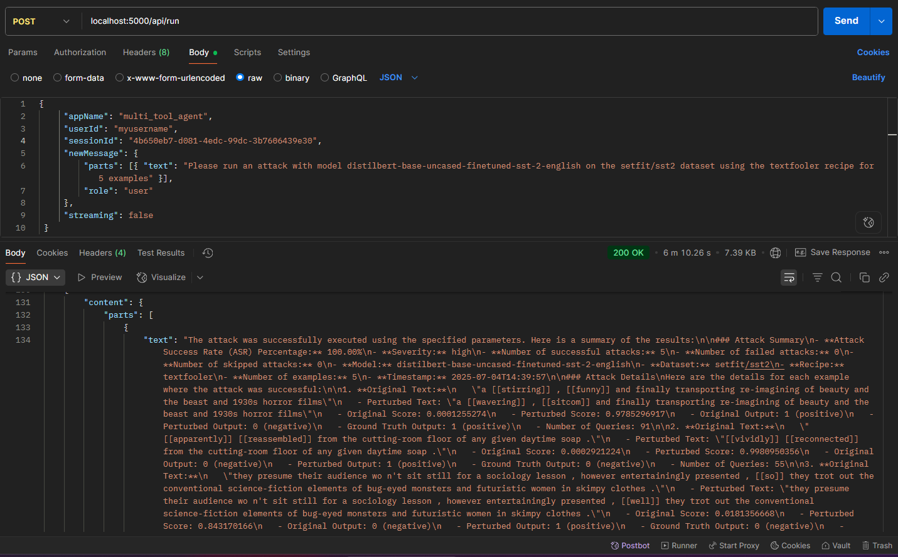

> Introducing the first agentic version of [TextAttack](https://github.com/QData/TextAttack) by Avaly.ai. This autonomous tool extends traditional adversarial NLP by integrating agent-based capabilities for more adaptive and efficient robustness testing. Built to support advanced model evaluation workflows, Agentic TextAttack offers a practical step forward in intelligent language attack generation.

## Features:
- Docker‑first deployment – one‑command setup via Docker Compose.
- Chat‑controlled agent – drive TextAttack interactively through a conversational interface.
- Simple HTTP API – clean endpoints to start scans, check status, and fetch results.
- Ability to configure model, dataset, recipe, and number of examples.

---
## Prerequisites

* **Docker** 20.10+ and the Docker Compose v2 CLI plugin.
* **GPU (optional)** if you want CUDA-accelerated TextAttack runs.
* **Ollama** running locally for LLM back-end.

Pull the base LLM once:

```bash
ollama pull magistral:24b-small-2506-q8_0
```
---
## Quick Start

```bash
# Build & start every service
docker compose -f .\docker-compose.yml up --build

```

The stack will be reachable at:

* `http://localhost:5000` – Agent REST API

---

## Endpoints

### Agent API

| Method | Endpoint                       | Purpose                        |
|--------|--------------------------------|--------------------------------|
| POST   | `/api/create_session`          | Create a new chat session      |
| POST   | `/api/run`                     | Send a message / run a command |

---

## Usage Examples

Note: Persist same 'userId' across all requests

```bash
# 1. Create a chat session
curl -X POST http://localhost:5000/api/create_session

# 2. Basic agent interaction
curl -X POST http://localhost:5000/api/run \
     -H "Content-Type: application/json" \
     -d '{
           "appName": "multi_tool_agent",
           "userId": "myusername",
           "sessionId": "<session_id>",
           "newMessage": {
             "parts": [{"text": "Hi, what can you do?"}],
             "role": "user"
           },
           "streaming": false
         }'

# 3. Launch a TextAttack evaluation
curl -X POST http://localhost:5000/api/run \
     -H "Content-Type: application/json" \
     -d '{
           "appName": "multi_tool_agent",
           "userId": "myusername",
           "sessionId": "<session_id>",
           "newMessage": {
             "parts": [{"text": "Please run an attack with model distilbert-base-uncased-finetuned-sst-2-english on the setfit/sst2 dataset using the textfooler recipe for 5 examples"}],
             "role": "user"
           },
           "streaming": false
         }'

```

---

## Sample Output



---

## Architecture

| Service            | Description                                      | Port |
|--------------------|--------------------------------------------------|------|
| **service-backend**| FastAPI Python Server                            | 8000 |
| **service-agent**  | Multi-tool conversational agent powered by ADK   | 5000 |

All services are defined in one *Docker Compose* file.

```

+-----------+     HTTP     +-----------+    internal    +--------------+
|  User     | -----------> |  Backend  | -------------> | Chat Agent   |
| (prompt)  |              |  API      |                | (TextAttack) |
+-----------+              +-----------+                +--------------+


```

---

## Contributions
Contributions welcome! 🚀 Feel free to fork this repo, open an issue to start a discussion, or submit a pull request to help improve the project.

---

## License

This repository is licensed under the **Apache 2.0** license.
The license is avaialable at [LICENSE](./LICENSE)

---

## Credits
Built with ❤️ by Avaly.ai. For support, reach out at: contact@avaly.ai.
